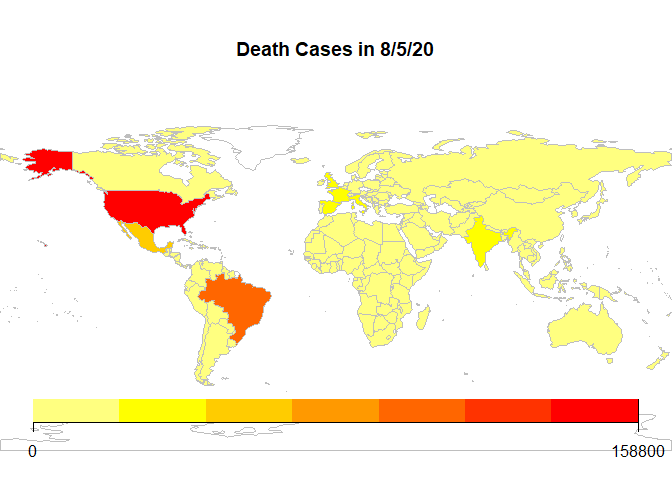
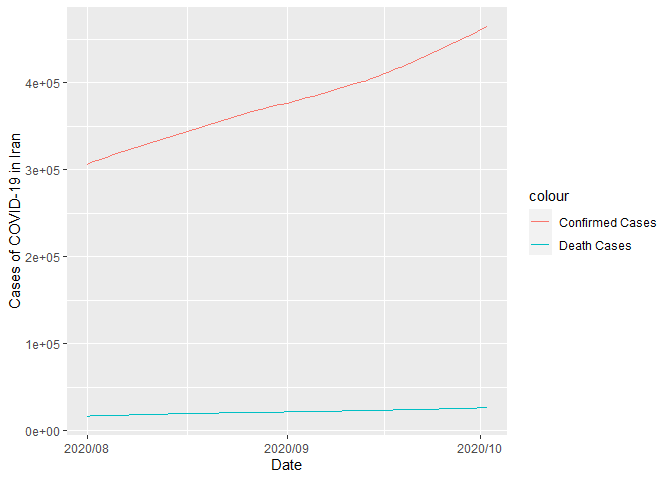

# CoronaExtra

The goal of CoronaExtra is to provide some geological and historical 
data regarding the spread of COVID-19 throughout the world. CoronaExtran also pays homage to Cervecería Modelo and all the businesses that suffered during this pandemic.

## Installation

You can install the released version of CoronaExtra from github with:

``` r
install_github("HappySpectre/CoronaExtra")
```

## Example

The following code shows how to use the C19WorldMap and COVID19vsTime
functions.

``` r
library(CoronaExtra)
C19WorldMap(type = 1, date = "8/5/20")
```



``` r
library(CoronaExtra)
COVID19vsTime(Country = "Iran", Start = "2020-08-01", Stop = "2020-10-02")
```



The data set used in this package as reference is provided by Johns
Hopkins University and can be found at
<https://github.com/CSSEGISandData/COVID-19>.

``` r
head(data)
#>        Country/Region       Lat      Long 1/22/20 1/23/20 1/24/20 1/25/20
#> 1         Afghanistan  33.93911  67.70995       0       0       0       0
#> 2             Albania  41.15330  20.16830       0       0       0       0
#> 3             Algeria  28.03390   1.65960       0       0       0       0
#> 4             Andorra  42.50630   1.52180       0       0       0       0
#> 5              Angola -11.20270  17.87390       0       0       0       0
#> 6 Antigua and Barbuda  17.06080 -61.79640       0       0       0       0
```
